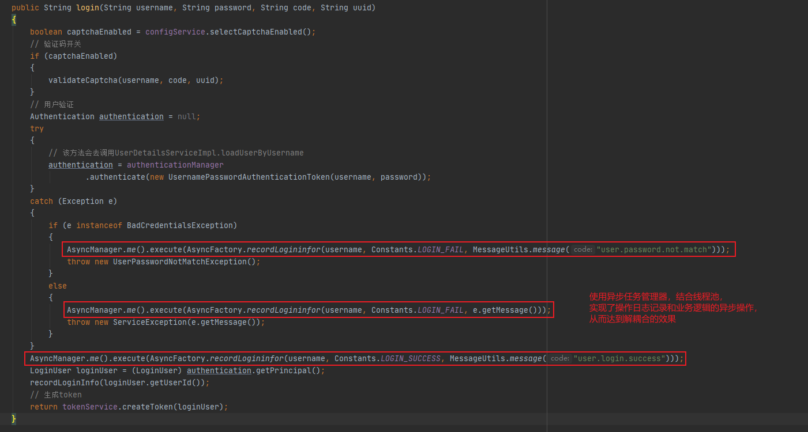
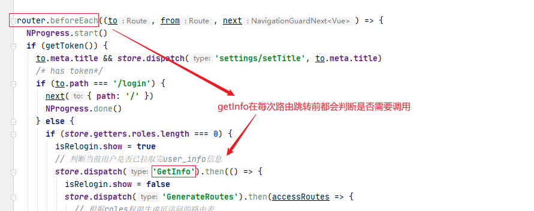
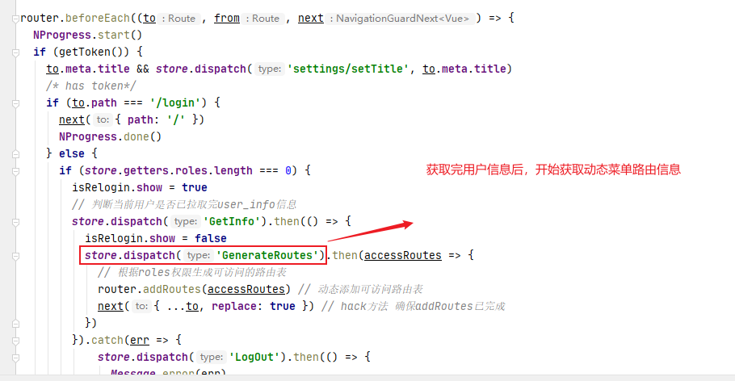
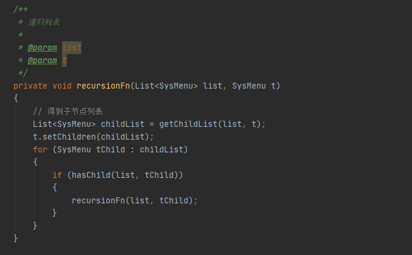
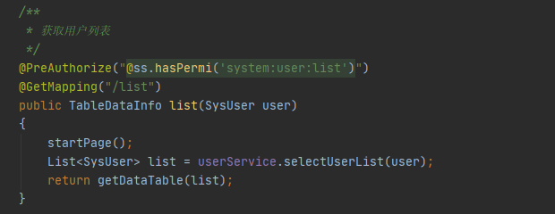

# 若依（前后端分离版）


## 一、什么是若依？

开源项目，学习开源项目的目标：

1、学习如何使用，减少自己的工作量

2、学习优秀开源项目底层的编程思想，设计思路，提高自己的编程能力

官网：http://www.ruoyi.vip/

基础：Spring Boot + Vue

环境要求：

- JDK1.8
- MySQL
- Redis
- Maven
- Vue


## 二、使用若依

> 使用开源项目的步骤：
>
> 1、下载并运行
>
> 2、看懂业务流程
>
> 3、进行二次开发

1.下载源码

略


2、配置数据库

①运行`sql`目录下的脚本文件以创建数据库

②在工程中配置数据库


MySQL配置

```yml
url: jdbc:mysql://localhost:3306/my-ruoyi?useUnicode=true&characterEncoding=utf8&zeroDateTimeBehavior=convertToNull&useSSL=true&serverTimezone=Asia/Shanghai
username: root
password: 1234
```

Redis配置

```yml
  redis:
    # 地址
    host: 192.168.248.129
    # 端口，默认为6379
    port: 6379
    # 数据库索引
    database: 1
    # 密码
    password: "1234"
```

启动项目后访问：http://localhost:8080/


3、运行前端项目

①运行命令`npm run install`

②运行命令`npm run dev`

启动项目后访问：http://localhost:80/


## 三、流程分析

对整个项目的功能的业务逻辑进行分析，梳理流程

### 1.登录

#### 1.1 生成验证码

> 基本思路
>
> 后端生成一个表达式，例如1+1=2
>
> 形式：1+1=?@2
>
> 1+1=? 转成图片，传到前端进行展示
>
> 2 存入Redis

Vue获取验证码图片的请求路径：http://localhost/dev-api/captchaImage（这是url请求的是前端）

url请求前端，通过**反向代理**，映射到后端，以此解决==跨域问题==


'/dev-api' 会被替换成 '' 再映射到 http://localhost:8080

http://localhost/dev-api/captchaImage  ==> http://localhost:8080/captchaImage


后端代码

通过全局搜索关键字`captchaImage`可以找到ruoyi-admin模块下的CaptchaController

```java
/**
 * 生成验证码
 */
@GetMapping("/captchaImage")
public AjaxResult getCode(HttpServletResponse response) throws IOException
{
    AjaxResult ajax = AjaxResult.success();
    boolean captchaEnabled = configService.selectCaptchaEnabled();
    // 验证是否开启了验证码
    ajax.put("captchaEnabled", captchaEnabled);
    if (!captchaEnabled)
    {
        return ajax;
    }

    // 保存验证码信息
    String uuid = IdUtils.simpleUUID();
    String verifyKey = CacheConstants.CAPTCHA_CODE_KEY + uuid;

    String capStr = null, code = null;
    BufferedImage image = null;

    // 生成验证码
    String captchaType = RuoYiConfig.getCaptchaType();
    // 判断验证类型是数字还是字符
    if ("math".equals(captchaType))
    {
        // 生成“验证码@答案”公式
        String capText = captchaProducerMath.createText();
        // 分割验证码
        capStr = capText.substring(0, capText.lastIndexOf("@"));
        // 分割答案
        code = capText.substring(capText.lastIndexOf("@") + 1);
        // 根据验证码生成图片
        image = captchaProducerMath.createImage(capStr);
    }
    else if ("char".equals(captchaType))
    {
        capStr = code = captchaProducer.createText();
        image = captchaProducer.createImage(capStr);
    }

    // 将验证码的答案存入Redis中，并设置有效时长
    redisCache.setCacheObject(verifyKey, code, Constants.CAPTCHA_EXPIRATION, TimeUnit.MINUTES);
    // 转换流信息写出
    FastByteArrayOutputStream os = new FastByteArrayOutputStream();
    try
    {
        ImageIO.write(image, "jpg", os);
    }
    catch (IOException e)
    {
        return AjaxResult.error(e.getMessage());
    }

    ajax.put("uuid", uuid);
    ajax.put("img", Base64.encode(os.toByteArray()));
    return ajax;
}
```


#### 1.2 登录

登录表单在`src\views\login.vue`文件中


登录的具体流程：（后端）

1、校验验证码

2、校验用户名和密码

3、生成Token




#### 1.3 getInfo



获取当前用户的角色和权限信息，存储到Vuex中

其中admin角色的权限为：`*:*:*`，代表所有权限


#### 1.4 getRouters

根据当前登录用户的权限获取动态菜单路由



后端利用递归，生成权限树




### 2.用户管理

流程：加载Vue页面 ==> 请求后台数据

#### 2.1 getList



①startPage() 分页

PageHelper中的reasonable对参数进行逻辑处理，保证参数的正确性

例如：当pageNum传入 0或-1 时，pageNum会被自动置为 1

②userService.selectUserList(user);

注解：`@DataScope(deptAlias = "d", userAlias = "u")`

给表设置别名：sys_dept 别名为 d；sys_user 别名为 u


#### 2.2 getTreeSelect

1.查出所有部门的数据

2.组装成树状结构

`buildDeptTreeSelect`将10条记录组装成一个树

`recursionFn(depts, dept);` 递归函数

①先找到顶级节点，然后找到其子节点

②遍历顶级节点的子节点，找到它们的子节点


### 3.增删改：略


### 4.异步任务管理器

在`SysLoginService`的login方法中有这样一行代码

```java
AsyncManager.me().execute(
    AsyncFactory.recordLogininfor(
        username,
        Constants.LOGIN_FAIL,
        MessageUtils.message("user.password.not.match")
    )
);
```

这行代码的作用：通过异步任务管理器记录登录日志

①AsyncManager类是单例的，通过me()方法获取一个**异步任务管理器**对象实例

②执行异步任务管理器的execute()方法，执行异步任务，异步任务是作为参数传入进来的

- execute()方法内部，会将传入的异步任务交给**线程池**来分配线程去执行

③异步任务对象实例是通过异步工厂AsyncFactory的对应方法recordLogininfor()生成的

- AsyncFactory内部定义了一个`异步操作任务调度线程池`

- recordLogininfor()方法返回了一个异步任务对象实例，任务主要内容为：封装登录用户的信息，执行添加操作
- 异步任务类实现了Runnable接口，由一个线程Thread单独去执行

```java
/**
 * 记录登录信息
 * 
 * @param username 用户名
 * @param status 状态
 * @param message 消息
 * @param args 列表
 * @return 任务task
 */
public static TimerTask recordLogininfor(final String username, final String status, final String message,
                                         final Object... args)
{
    final UserAgent userAgent = UserAgent.parseUserAgentString(ServletUtils.getRequest().getHeader("User-Agent"));
    final String ip = IpUtils.getIpAddr(ServletUtils.getRequest());
    return new TimerTask()
    {
        @Override
        public void run()
        {
            String address = AddressUtils.getRealAddressByIP(ip);
            StringBuilder s = new StringBuilder();
            s.append(LogUtils.getBlock(ip));
            s.append(address);
            s.append(LogUtils.getBlock(username));
            s.append(LogUtils.getBlock(status));
            s.append(LogUtils.getBlock(message));
            // 打印信息到日志
            sys_user_logger.info(s.toString(), args);
            // 获取客户端操作系统
            String os = userAgent.getOperatingSystem().getName();
            // 获取客户端浏览器
            String browser = userAgent.getBrowser().getName();
            // 封装对象
            SysLogininfor logininfor = new SysLogininfor();
            logininfor.setUserName(username);
            logininfor.setIpaddr(ip);
            logininfor.setLoginLocation(address);
            logininfor.setBrowser(browser);
            logininfor.setOs(os);
            logininfor.setMsg(message);
            // 日志状态
            if (StringUtils.equalsAny(status, Constants.LOGIN_SUCCESS, Constants.LOGOUT, Constants.REGISTER))
            {
                logininfor.setStatus(Constants.SUCCESS);
            }
            else if (Constants.LOGIN_FAIL.equals(status))
            {
                logininfor.setStatus(Constants.FAIL);
            }
            // 插入数据
            SpringUtils.getBean(ISysLogininforService.class).insertLogininfor(logininfor);
        }
    };
}
```


### 5.代码自动生成

**使用步骤**

1、创建数据表

2、使用系统工具 ==> 代码生成

3、编辑参数

4、点击生成代码

5、解压代码压缩包

- main（Java后端代码）
- vue（Vue前端代码）
- SQL（菜单的SQL语句）

6、导入代码，重启项目
