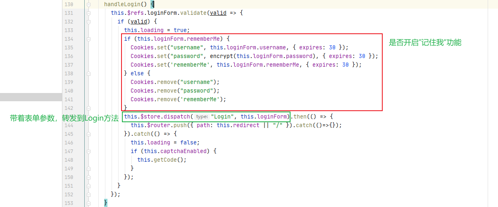

# 若依（前后端分离版）


## 一、什么是若依？

开源项目，学习开源项目的目标：

1、学习如何使用，减少自己的工作量

2、学习优秀开源项目底层的编程思想，设计思路，提高自己的编程能力

官网：http://www.ruoyi.vip/

基础：Spring Boot + Vue

环境要求：

- JDK1.8
- MySQL
- Redis
- Maven
- Vue


## 二、使用若依

> 使用开源项目的步骤：
>
> 1、下载并运行
>
> 2、看懂业务流程
>
> 3、进行二次开发

1.下载源码

略


2、配置数据库

①运行`sql`目录下的脚本文件以创建数据库

②在工程中配置数据库


MySQL配置

```yml
url: jdbc:mysql://localhost:3306/my-ruoyi?useUnicode=true&characterEncoding=utf8&zeroDateTimeBehavior=convertToNull&useSSL=true&serverTimezone=Asia/Shanghai
username: root
password: 1234
```

Redis配置

```yml
  redis:
    # 地址
    host: 192.168.248.129
    # 端口，默认为6379
    port: 6379
    # 数据库索引
    database: 1
    # 密码
    password: "1234"
```

启动项目后访问：http://localhost:8080/


3、运行前端项目

①运行命令`npm run install`

②运行命令`npm run dev`

启动项目后访问：http://localhost:80/


## 三、流程分析

对整个项目的功能的业务逻辑进行分析，梳理流程

### 1.登录

#### 1.1生成验证码

> 基本思路
>
> 后端生成一个表达式，例如1+1=2
>
> 形式：1+1=?@2
>
> 1+1=? 转成图片，传到前端进行展示
>
> 2 存入Redis

Vue获取验证码图片的请求路径：http://localhost/dev-api/captchaImage（这是url请求的是前端）

url请求前端，通过**反向代理**，映射到后端，以此解决==跨域问题==


'/dev-api' 会被替换成 '' 再映射到 http://localhost:8080

http://localhost/dev-api/captchaImage  ==> http://localhost:8080/captchaImage


后端代码

通过全局搜索关键字`captchaImage`可以找到ruoyi-admin模块下的CaptchaController

```java
/**
 * 生成验证码
 */
@GetMapping("/captchaImage")
public AjaxResult getCode(HttpServletResponse response) throws IOException
{
    AjaxResult ajax = AjaxResult.success();
    boolean captchaEnabled = configService.selectCaptchaEnabled();
    // 验证是否开启了验证码
    ajax.put("captchaEnabled", captchaEnabled);
    if (!captchaEnabled)
    {
        return ajax;
    }

    // 保存验证码信息
    String uuid = IdUtils.simpleUUID();
    String verifyKey = CacheConstants.CAPTCHA_CODE_KEY + uuid;

    String capStr = null, code = null;
    BufferedImage image = null;

    // 生成验证码
    String captchaType = RuoYiConfig.getCaptchaType();
    // 判断验证类型是数字还是字符
    if ("math".equals(captchaType))
    {
        // 生成“验证码@答案”公式
        String capText = captchaProducerMath.createText();
        // 分割验证码
        capStr = capText.substring(0, capText.lastIndexOf("@"));
        // 分割答案
        code = capText.substring(capText.lastIndexOf("@") + 1);
        // 根据验证码生成图片
        image = captchaProducerMath.createImage(capStr);
    }
    else if ("char".equals(captchaType))
    {
        capStr = code = captchaProducer.createText();
        image = captchaProducer.createImage(capStr);
    }

    // 将验证码的答案存入Redis中，并设置有效时长
    redisCache.setCacheObject(verifyKey, code, Constants.CAPTCHA_EXPIRATION, TimeUnit.MINUTES);
    // 转换流信息写出
    FastByteArrayOutputStream os = new FastByteArrayOutputStream();
    try
    {
        ImageIO.write(image, "jpg", os);
    }
    catch (IOException e)
    {
        return AjaxResult.error(e.getMessage());
    }

    ajax.put("uuid", uuid);
    ajax.put("img", Base64.encode(os.toByteArray()));
    return ajax;
}
```


#### 1.2登录

登录表单在`src\views\login.vue`文件中



登录的具体流程：（后端）

1、校验验证码

2、校验用户名和密码

3、生成Token

